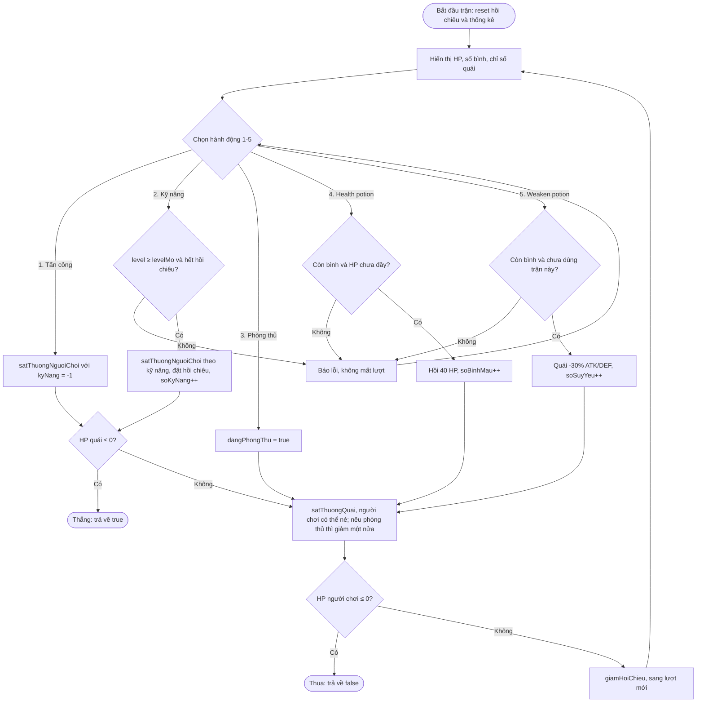

# C0726-Project-BuiKhangLong

## Đấu trường nhập vai theo lượt (Mini RPG)

- **Chủ đề:** #14 – Đấu trường nhập vai theo lượt (Mini RPG)
- **Học viên:** Bùi Khang Long
- **Ngôn ngữ:** C++ (console)

---

## 1. Mô tả bài toán

Người chơi chọn độ khó, nhập tên để tạo nhân vật **Ranger**, sau đó leo tháp gồm **3 tầng, mỗi tầng 10 stage, mỗi stage 1 quái vật** (tổng 30 quái, mạnh dần; stage cuối mỗi tầng là **Boss**). Mỗi lượt người chơi chọn **Tấn công / Kỹ năng / Phòng thủ / Health potion / Weaken potion**, sau đó quái vật tấn công lại.

- Hạ 1 quái: **lên 1 cấp** (tối đa level 31), nhận **1 điểm talent**, **hồi đầy HP** cho stage sau, nhận **gold** (có 5% nổ **JACKPOT**) và có thể nhặt được bình thuốc.
- Sau mỗi stage hiện **bảng kết quả**: ải đã thắng, số lượt, số kỹ năng đã dùng, điểm talent, số bình đã dùng, gold nhận được.
- Dùng gold mua bình ở **cửa hàng**, dùng điểm talent để tăng HP / ATK / DEF.
- Kỹ năng mở theo level: kỹ năng 1, 2, 3 mở ở **level 1, 3, 5**.
- Độ khó ảnh hưởng chỉ số quái, lượng gold và số weaken potion được mang.
- Nhân vật chỉ có 1 mạng: HP về 0 là **thua**, phải tạo nhân vật mới để chơi lại.
- Hạ cả 30 quái thì **thắng**.

## 2. Phân tích dữ liệu

### 2.1. Struct `ChiSo` (bộ chỉ số của nhân vật)

Dùng cho chỉ số của nhân vật, chỉ số ban đầu (`CHI_SO_BAN_DAU`), phần thưởng talent và phần thưởng tự động khi lên cấp, nhờ đó chỉ cần 1 hàm `congChiSo` để cộng chỉ số.

| Thuộc tính | Kiểu | Ý nghĩa | Ràng buộc |
|---|---|---|---|
| `hp` | `int` | HP tối đa | > 0 |
| `atk` | `int` | Sức tấn công | ≥ 0 |
| `def` | `int` | Phòng thủ, trừ vào sát thương nhận | ≥ 0 |
| `critRate` | `int` | Tỉ lệ chí mạng (%) | Cố định 20 |
| `critDmg` | `int` | Sát thương chí mạng (% so với đòn thường) | Cố định 300 |
| `evasion` | `int` | Tỉ lệ né đòn (%) | Cố định 20 |

### 2.2. Struct `NhanVat` (người chơi)

| Thuộc tính | Kiểu | Ràng buộc |
|---|---|---|
| `ten` | `string` | Không rỗng, tối đa 20 ký tự |
| `hp` | `int` | 0 ≤ hp ≤ `cs.hp` |
| `cs` | `ChiSo` | Chỉ số hiện tại |
| `level` | `int` | 1 – `MAX_LEVEL` (31) |
| `binhMau` | `int` | Health potion: 0 ≤ binhMau ≤ `MAX_BINH_MAU` (5) |
| `binhSuyYeu` | `int` | Weaken potion: 0 ≤ binhSuyYeu ≤ `doKho.maxSuyYeu` |
| `vang` | `int` | Gold, ≥ 0 |
| `diemTalent` | `int` | ≥ 0 |
| `hoiChieuConLai[3]` | `int` | ≥ 0; bằng 0 là dùng được |

### 2.3. Struct `QuaiVat`

| Thuộc tính | Kiểu | Ràng buộc |
|---|---|---|
| `ten` | `string` | Tên theo tầng (Slime / Skeleton / Demon); boss thêm "King" |
| `hp` | `int` | 0 ≤ hp ≤ hpToiDa |
| `hpToiDa` | `int` | > 0 |
| `atk` | `int` | > 0 (giảm 30% nếu trúng weaken potion) |
| `def` | `int` | ≥ 0 (giảm 30% nếu trúng weaken potion) |

### 2.4. Struct `KyNang`

| Thuộc tính | Kiểu | Ràng buộc |
|---|---|---|
| `ten` | `string` | Không rỗng |
| `satThuongGoc` | `int` | ≥ 0 |
| `heSoAtk` | `int` | % ATK cộng vào sát thương, ≥ 0 |
| `hoiChieu` | `int` | Số lượt hồi chiêu, > 0 |
| `levelMo` | `int` | Level mở kỹ năng (1, 3, 5); dùng được khi `nv.level ≥ levelMo` |

### 2.5. Struct `Talent`

| Thuộc tính | Kiểu | Ràng buộc |
|---|---|---|
| `ten` | `string` | Không rỗng |
| `thuong` | `ChiSo` | Chỉ số cộng thêm mỗi điểm (chỉ HP, ATK hoặc DEF) |

### 2.6. Struct `DoKho`

| Thuộc tính | Kiểu | Ràng buộc |
|---|---|---|
| `ten` | `string` | Easy / Normal / Hardcore |
| `heSoQuai` | `int` | % nhân vào HP/ATK/DEF của quái, > 0 |
| `heSoVang` | `int` | % nhân vào gold rơi ra, > 0 |
| `maxSuyYeu` | `int` | Số weaken potion được mang tối đa, ≥ 1 |

### 2.7. Struct `KetQuaTran` (thống kê 1 trận)

| Thuộc tính | Kiểu | Ràng buộc |
|---|---|---|
| `soLuot` | `int` | Số lượt đã hoàn thành, ≥ 1 |
| `soKyNang` | `int` | Số lần dùng kỹ năng, ≥ 0 |
| `soBinhMau` | `int` | Số health potion đã dùng, ≥ 0 |
| `soSuyYeu` | `int` | Số weaken potion đã dùng, 0 – 1 |

### 2.8. Hằng số chính

| Hằng | Giá trị | Ý nghĩa |
|---|---|---|
| `SO_TANG` × `SO_STAGE_MOI_TANG` | 3 × 10 | Cấu trúc tháp |
| `TONG_STAGE` | 30 | Tổng số quái phải hạ |
| `MAX_LEVEL` | 31 | Level tối đa = 1 + `TONG_STAGE` |
| `HE_SO_BOSS_HP` / `HE_SO_BOSS_ATK_DEF` | 300 / 150 | % HP và ATK/DEF của boss so với quái stage trước |
| `BINH_MAU_BAN_DAU` | 3 | Số health potion khi tạo nhân vật |
| `MAX_BINH_MAU` | 5 | Túi health potion tối đa |
| `HOI_MAU` | 40 | HP hồi mỗi health potion |
| `GIAM_SUY_YEU` | 30 | % ATK và DEF của quái bị giảm bởi weaken potion |
| `TI_LE_ROI_BINH_MAU` / `TI_LE_ROI_SUY_YEU` | 10 / 2 | % quái rơi health / weaken potion |
| `GIA_BINH_MAU` / `GIA_SUY_YEU` | 20 / 100 | Giá bán trong cửa hàng (gold) |
| `VANG_CO_BAN` | 5 | Gold cơ bản x = `VANG_CO_BAN` + stage |
| `HE_SO_VANG_BOSS` | 3 | Boss rơi gấp 3 gold |
| `TI_LE_JACKPOT` / `HE_SO_JACKPOT` | 5 / 5 | 5% nổ jackpot, nhận x × 5 gold |

### 2.9. Nhân vật Ranger

Chỉ số ban đầu khai báo trong hằng `CHI_SO_BAN_DAU`:

| HP | ATK | DEF | Crit Rate | Crit Dmg | Evasion |
|---|---|---|---|---|---|
| 95 | 21 | 7 | 20% | 300% | 20% |

Khởi đầu ở level 1 với 3 health potion, 0 weaken potion, 0 gold.

### 2.10. Kỹ năng

Khai báo trong mảng hằng `DS_KY_NANG[3]`. Sát thương kỹ năng = `satThuongGoc + ATK × heSoAtk%`.

| # | Kỹ năng | Gốc | % ATK | Hồi chiêu | Mở ở level |
|---|---|---|---|---|---|
| 0 | Double Shot | 0 | 170 | 2 | 1 |
| 1 | Arrow Rain | 10 | 150 | 3 | 3 |
| 2 | Piercing Shot | 25 | 230 | 5 | 5 |

### 2.11. Talent

Mỗi lần lên cấp nhận 1 điểm talent, cộng vào 1 trong 3 chỉ số, không giới hạn số điểm mỗi loại. Khai báo trong mảng hằng `DS_TALENT[3]`.

| # | Talent | Mỗi điểm cộng |
|---|---|---|
| 1 | HP +15 | +15 HP tối đa (và +15 HP hiện tại) |
| 2 | ATK +3 | +3 ATK |
| 3 | DEF +2 | +2 DEF |

### 2.12. Tháp, quái vật và độ khó

Stage được đánh số liên tục `s` = 1 – 30 và hiển thị dạng **tầng-stage** (ví dụ `s` = 13 → `2-3`).

| Tầng | Stage | Quái | Boss (stage cuối) |
|---|---|---|---|
| 1 | 1-1 → 1-10 | Slime | Slime King |
| 2 | 2-1 → 2-10 | Skeleton | Skeleton King |
| 3 | 3-1 → 3-10 | Demon | Demon King |

Chỉ số quái ở stage `s`: **HP = 40 + 12s, ATK = 10 + 2s, DEF = 2 + s**. Boss dùng chỉ số của stage trước, **HP × 3, ATK và DEF × 1.5**. Sau đó nhân hệ số độ khó.

| Độ khó | Chỉ số quái | Gold | Weaken potion tối đa |
|---|---|---|---|
| Easy | 80% | 100% | 3 |
| Normal (mặc định) | 100% | 100% | 3 |
| Hardcore | 130% | 50% | 1 |

### 2.13. Gold, jackpot, vật phẩm rơi và cửa hàng

**Gold cơ bản** mỗi stage: `x = (5 + s)`, boss × 3, rồi nhân `heSoVang` của độ khó.

| Stage | x (Easy / Normal) | x (Hardcore) | Jackpot (x × 5, Normal) | Jackpot (Hardcore) |
|---|---|---|---|---|
| 1-1 | 6 | 3 | 30 | 15 |
| 1-10 (boss) | 45 | 22 | 225 | 110 |
| 2-5 | 20 | 10 | 100 | 50 |
| 3-9 | 34 | 17 | 170 | 85 |
| 3-10 (boss) | 105 | 52 | 525 | 260 |

Jackpot tính trên x đã nhân độ khó, nên ở Hardcore một lần jackpot thường chỉ đủ mua khoảng 1 weaken potion, không làm game quá dễ. Kỳ vọng jackpot chỉ cộng thêm khoảng 20% gold so với không có jackpot.

**Vật phẩm rơi** khi hạ quái (tính độc lập): 10% health potion, 2% weaken potion. Nếu túi đã đầy thì vật phẩm bị bỏ lại.

**Cửa hàng** (menu 7):

| Món | Giá | Tác dụng | Giới hạn mang |
|---|---|---|---|
| Health potion | 20 gold | Hồi 40 HP | 5 |
| Weaken potion | 100 gold | Quái −30% ATK và DEF đến hết trận, mỗi trận dùng tối đa 1 lần | 3 (Hardcore: 1) |

### 2.14. Quy tắc tính toán

| Quy tắc | Công thức |
|---|---|
| Đòn thường | `ATK – DEF quái + ngẫu nhiên [-3, 3]`, tối thiểu 1 |
| Kỹ năng | `satThuongGoc + ATK × heSoAtk% – DEF quái + ngẫu nhiên [-3, 3]`, tối thiểu 1 |
| Chí mạng (chỉ người chơi) | Ngẫu nhiên [0, 99] < `critRate` → sát thương × `critDmg`% |
| Quái tấn công | `ATK quái – DEF người chơi + ngẫu nhiên [-3, 3]`, tối thiểu 1 |
| Né đòn (chỉ người chơi) | Ngẫu nhiên [0, 99] < `evasion` → không nhận sát thương |
| Phòng thủ | Sát thương nhận ở lượt đó giảm một nửa |
| Hồi chiêu | Sau khi dùng: `hoiChieuConLai = hoiChieu`; giảm 1 sau mỗi lượt; reset về 0 khi bắt đầu trận mới |
| Health potion | Hồi 40 HP, không vượt `cs.hp` |
| Weaken potion | `quai.atk`, `quai.def` giảm 30%; mỗi trận tối đa 1 lần |
| Lên cấp | Chỉ khi level < 31: level +1; +10 HP tối đa, +2 ATK, +1 DEF (`THUONG_LEN_CAP`); +1 điểm talent; báo kỹ năng mới nếu level = `levelMo` |
| Sau khi thắng stage | Nhận gold (có thể jackpot), tính vật phẩm rơi, lên cấp, **hồi đầy HP** |

## 3. Danh sách chức năng

| # | Chức năng | Input | Xử lý | Output | Trường hợp lỗi |
|---|---|---|---|---|---|
| 1 | Tạo nhân vật | Tên | Gán `CHI_SO_BAN_DAU`, level 1, 3 health potion, 0 gold; reset stage | Thông báo tạo thành công | Tên rỗng; tên quá 20 ký tự |
| 2 | Chọn độ khó | Mức độ khó (1–3) | Gán `doKho` | Độ khó mới | Nhập sai; đã qua stage 1-1 thì không cho đổi |
| 3 | Xem trạng thái | – | In chỉ số, gold, số bình, điểm talent, trạng thái kỹ năng | Bảng trạng thái | Chưa tạo nhân vật |
| 4 | Talent | Chỉ số muốn cộng (0–3) | Kiểm tra còn điểm; cộng HP, ATK hoặc DEF; lặp đến khi hết điểm hoặc chọn 0 | Chỉ số mới, điểm còn lại | Chưa tạo nhân vật; hết điểm; nhập sai |
| 5 | Vào đấu trường | Hành động mỗi lượt (1–5) | Sinh quái theo stage và độ khó, lặp các lượt đến khi một bên hết HP | Diễn biến từng lượt, bảng kết quả stage hoặc GAME OVER | Chưa tạo nhân vật; đã thắng/thua; lựa chọn sai |
| 5a | Tấn công | – | Tính sát thương đòn thường và chí mạng | Sát thương, báo chí mạng | – |
| 5b | Kỹ năng | Kỹ năng (0–3) | Tính sát thương kỹ năng, đặt hồi chiêu | Sát thương, hồi chiêu | Chưa đủ level; đang hồi chiêu (không mất lượt) |
| 5c | Phòng thủ | – | Bật cờ phòng thủ cho lượt này | Thông báo | – |
| 5d | Health potion | – | Hồi 40 HP, trừ 1 bình | HP mới, số bình còn lại | Hết bình; HP đã đầy (không mất lượt) |
| 5e | Weaken potion | – | Giảm 30% ATK/DEF của quái, trừ 1 bình | Chỉ số mới của quái | Hết bình; đã dùng trong trận này (không mất lượt) |
| 5f | Kết thúc stage | – | Nhận gold, jackpot, vật phẩm rơi; lên cấp; hồi đầy HP | Bảng kết quả stage | Túi đầy thì bỏ vật phẩm rơi |
| 6 | Hướng dẫn | – | – | Luật chơi | – |
| 7 | Cửa hàng | Món hàng (0–2) | Kiểm tra gold và giới hạn túi; trừ gold, cộng bình; lặp đến khi chọn 0 | Gold và số bình mới | Chưa tạo nhân vật; không đủ gold; túi đầy; nhập sai |
| 0 | Thoát | – | Kết thúc vòng lặp menu | Lời chào | – |

**Bảng kết quả sau mỗi stage** (chức năng 5f):
```
+========== KET QUA STAGE ==========+
| Ai chien thang        : 1-3
| So luot hoan thanh    : 4
| So ky nang da dung    : 2
| Diem talent nhan duoc : 1
| Health potion da dung : 0
| Weaken potion da dung : 0
| Gold nhan duoc        : 40  *** JACKPOT! ***
| Vat pham roi          : Health potion x1
+===================================+
```

## 4. Thiết kế

### 4.1. Nguyên mẫu hàm

```cpp
string tenStage(int stage);
void hienThiMenu(const DoKho &doKho, int stage);
int nhapSoNguyen(string loiNhac, int nhoNhat, int lonNhat);
string nhapTen(string loiNhac, int doDaiToiDa);
void congChiSo(ChiSo &cs, const ChiSo &them);

void chonDoKho(DoKho &doKho, int stage);
void taoNhanVat(NhanVat &nv, bool &daTao);
QuaiVat taoQuai(int stage, const DoKho &doKho);
void hienThiTrangThai(const NhanVat &nv, const DoKho &doKho);
void hienThiTalent(const NhanVat &nv);
void nangTalent(NhanVat &nv);
void cuaHang(NhanVat &nv, const DoKho &doKho);
void hienThiHuongDan();

int satThuongNguoiChoi(const NhanVat &nv, const QuaiVat &quai, int kyNang, bool &chiMang);
int satThuongQuai(const QuaiVat &quai, const NhanVat &nv, bool &ne);
bool dungKyNang(NhanVat &nv, QuaiVat &quai);
void giamHoiChieu(NhanVat &nv);
bool dungBinhMau(NhanVat &nv);
bool dungBinhSuyYeu(NhanVat &nv, QuaiVat &quai, bool &daSuyYeu);
bool lenCap(NhanVat &nv);
void hienThiLuot(const NhanVat &nv, const QuaiVat &quai, int luot);
bool chienDau(NhanVat &nv, QuaiVat quai, KetQuaTran &kq);

int tinhVang(int stage, const DoKho &doKho);
void nhanPhanThuong(NhanVat &nv, int stage, const DoKho &doKho, int &vang, bool &jackpot, string &roiDo);
void hienThiKetQuaStage(int stage, const KetQuaTran &kq, int diemTalent, int vang, bool jackpot, string roiDo);
void vaoDauTruong(NhanVat &nv, bool daTao, int &stage, bool &daKetThuc, const DoKho &doKho);
```

### 4.2. Mã giả – `taoQuai`

```
HÀM taoQuai(stage, doKho):
    tang ← (stage − 1) / SO_STAGE_MOI_TANG
    laBoss ← (stage chia hết cho SO_STAGE_MOI_TANG)
    NẾU laBoss THÌ s ← stage − 1, heSoHp ← 300, heSoAtkDef ← 150
    NGƯỢC LẠI       s ← stage,     heSoHp ← 100, heSoAtkDef ← 100
    quai.hpToiDa ← (40 + 12 × s) × heSoHp × doKho.heSoQuai / 10000
    quai.atk ← (10 + 2 × s) × heSoAtkDef × doKho.heSoQuai / 10000
    quai.def ← (2 + s) × heSoAtkDef × doKho.heSoQuai / 10000
    quai.hp ← quai.hpToiDa
    NẾU laBoss THÌ quai.ten ← TEN_QUAI[tang] + " King"
    NGƯỢC LẠI       quai.ten ← TEN_QUAI[tang]
    TRẢ VỀ quai
```

### 4.3. Mã giả – `nhanPhanThuong`

```
HÀM nhanPhanThuong(nv, stage, doKho, vang, jackpot, roiDo):
    vang ← 5 + stage
    NẾU stage là boss THÌ vang ← vang × 3
    vang ← vang × doKho.heSoVang / 100
    jackpot ← (ngẫu nhiên [0, 99] < 5)
    NẾU jackpot THÌ vang ← vang × 5
    nv.vang ← nv.vang + vang

    roiDo ← ""
    NẾU ngẫu nhiên [0, 99] < 10 THÌ
        NẾU nv.binhMau < MAX_BINH_MAU THÌ nv.binhMau ← nv.binhMau + 1, ghi "Health potion x1"
        NGƯỢC LẠI ghi "Health potion x1 (túi đầy, bỏ lại)"
    NẾU ngẫu nhiên [0, 99] < 2 THÌ
        NẾU nv.binhSuyYeu < doKho.maxSuyYeu THÌ nv.binhSuyYeu ← nv.binhSuyYeu + 1, ghi "Weaken potion x1"
        NGƯỢC LẠI ghi "Weaken potion x1 (túi đầy, bỏ lại)"
    NẾU roiDo rỗng THÌ roiDo ← "Không có"
```

### 4.4. Mã giả – `satThuongNguoiChoi`

```
HÀM satThuongNguoiChoi(nv, quai, kyNang, chiMang):
    NẾU kyNang = −1 THÌ
        satThuong ← nv.cs.atk
    NGƯỢC LẠI
        kn ← DS_KY_NANG[kyNang]
        satThuong ← kn.satThuongGoc + nv.cs.atk × kn.heSoAtk / 100

    satThuong ← satThuong − quai.def + ngẫu nhiên trong [−3, 3]
    NẾU satThuong < 1 THÌ satThuong ← 1

    chiMang ← (ngẫu nhiên trong [0, 99] < nv.cs.critRate)
    NẾU chiMang THÌ satThuong ← satThuong × nv.cs.critDmg / 100
    TRẢ VỀ satThuong
```

### 4.5. Lưu đồ – `chienDau`



## 5. Biên dịch và chạy

- **Môi trường:** Windows, VS Code, trình biên dịch MinGW (g++).

```bash
g++ main.cpp -o mini_rpg.exe
mini_rpg.exe
```

## 6. Ảnh chụp màn hình

> Cập nhật sau khi hoàn thành từng chức năng.

| Chức năng | Ảnh |
|---|---|
| Menu chính | `images/menu.png` |
| Chọn độ khó | `images/do-kho.png` |
| Tạo nhân vật | `images/tao-nhan-vat.png` |
| Xem trạng thái | `images/trang-thai.png` |
| Talent | `images/talent.png` |
| Cửa hàng | `images/cua-hang.png` |
| Trận đấu (đòn thường, kỹ năng, né, chí mạng, weaken potion) | `images/chien-dau.png` |
| Bảng kết quả stage (có jackpot) | `images/ket-qua-stage.png` |
| Boss King | `images/boss.png` |
| Thắng / Thua | `images/ket-thuc.png` |
| Báo lỗi nhập sai | `images/bao-loi.png` |

## 7. Chức năng nâng cao

- [x] Chọn độ khó (Easy / Normal / Hardcore) ảnh hưởng chỉ số quái, gold và giới hạn weaken potion.
- [x] Hệ thống chỉ số: HP, ATK, DEF (tăng được) và Crit Rate, Crit Dmg, Evasion (cố định).
- [x] Tháp 3 tầng × 10 stage, Boss King ở stage cuối mỗi tầng.
- [x] Kỹ năng có hồi chiêu, mở theo level; điểm talent để tăng chỉ số.
- [x] Gold, jackpot, vật phẩm rơi, cửa hàng (health potion, weaken potion).
- [x] Bảng kết quả sau mỗi stage.